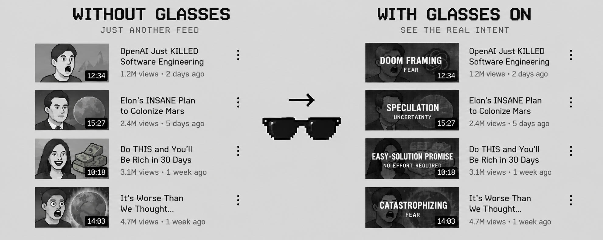

<p align="center">
  
</p>

# They Live: YouTube Glasses

A browser extension that shows the persuasion tactic in each YouTube video title.

The extension puts a mask on each thumbnail. The mask names the tactic that the title uses to get your click. Examples are `MANUFACTURED URGENCY` and `CURIOSITY GAP`. A dark mask means a strong tactic. Move the pointer over a thumbnail to see the original image.

## Inspiration

The film *They Live* (1988) has a pair of sunglasses. A person who wears them sees the hidden messages in advertising, such as `OBEY` and `CONSUME`.

This extension does the same for video titles. The glasses do not change the video. They show the message that is behind the title.

## Install

The extension works in Microsoft Edge and Google Chrome.

1. Get a Jev API key from TypeSafe.
2. Download this repository. Click **Code**, then **Download ZIP**. Unzip the file.
3. Open `edge://extensions`. In Chrome, open `chrome://extensions`.
4. Turn on **Developer mode**.
5. Click **Load unpacked**.
6. Select the `extension` folder.
7. The options page opens. Paste your API key into the key field.
8. Click **Test key**. The page shows `Key works.`
9. Click **Save**.
10. Open `youtube.com`. Reload the page.

The toolbar icon shows the state of the extension:

| Badge | Meaning |
| --- | --- |
| `ON` | The extension is active. |
| `OFF` | The extension is off. Click the icon to turn it on. |
| `ERR` | The API key is missing or rejected. Open the options page. |

## What the extension covers

| Covered | Not covered |
| --- | --- |
| Home feed | Ads |
| Search results | Channel pages |
| Watch-page sidebar | Subscriptions and history pages |
| Shorts tiles in these pages | The Shorts player |

## Where the extension uses Jev

Jev is a classification model from TypeSafe. The extension uses Jev for all classification. No other model is used.

For each video, the extension sends the title and the channel name to `https://api.typesafe.ai/v1/systemone`. The extension does not send the thumbnail, the video, or your account data.

## How Jev classifies a video

The taxonomy is in `extension/taxonomy.json`. It has 34 families, and 667 specific labels in total. Each family has a description. Each label has a description. One family, `neutral`, is for titles with no persuasion tactic.

Each video goes through two stages.

**Stage 1: family.** One request asks Jev three questions:

1. **Family.** Which of the 34 families fits the title best? Jev returns one family and a confidence value.
2. **Intensity.** How manipulative is the title? Jev scores the title on a scale of five levels. The score sets how dark the mask is.
3. **Manipulative.** Does the title use a persuasion tactic? Jev returns a probability.

**Stage 2: label.** A second request asks Jev for the specific label. Jev chooses from the labels of the family that stage 1 selected only.

The extension then applies your thresholds:

- If the family confidence is below its threshold, the thumbnail has no mask.
- If the manipulation probability is below its threshold, the thumbnail has no mask. This check does not apply to `neutral` titles.
- If the label confidence is below its threshold, the mask shows the family slogan only.

The mask shows the label as the large text and the family slogan as the small text. You can swap them in the options. Neutral titles get a green border.

The extension saves each result in your browser for 30 days. A video is classified again only if the model or the taxonomy changes.

## Options

Open the options page from the extension menu.

| Option | Default | Effect |
| --- | --- | --- |
| Family confidence | 0.35 | Minimum confidence for the family. |
| Manipulation | 0.5 | Minimum probability that the title uses a tactic. |
| Specific-tactic confidence | 0.3 | Minimum confidence for the specific label. |
| Big text | Label | Shows the label or the slogan as the large text. |
| Jev model | `jev-1.13.0` | The model version. Results are cached for each model. |

Set all three thresholds to `0.00` to label every video.

After you click **Save**, reload YouTube to apply the new settings.

## Privacy

- The extension stores your API key in `chrome.storage.local`. The key stays in your browser.
- The extension sends the title and the channel name of each video to `api.typesafe.ai`.
- The extension has no server of its own. It does not collect or send analytics.

## Limits

The labels are Jev's estimate from the words of the title only. A label is not a verdict on the video or on the creator. A label can be wrong.

YouTube changes its page structure often. If the extension stops labeling a part of YouTube, open an issue.

## Development

The `scripts` folder has three tools. Node.js 20.6 or later is necessary.

1. Copy `.env.example` to `.env`. Put your key in the file.
2. Run a script:

```sh
node scripts/validate-taxonomy.mjs
node --env-file=.env scripts/smoke-test.mjs
node --env-file=.env scripts/eval-golden.mjs
```

| Script | Purpose |
| --- | --- |
| `validate-taxonomy.mjs` | Checks the taxonomy file for errors. |
| `smoke-test.mjs` | Classifies three sample titles. |
| `eval-golden.mjs` | Tests Jev on the titles in `golden.json`. |

Never commit the `.env` file.

## License

[MIT](LICENSE)
